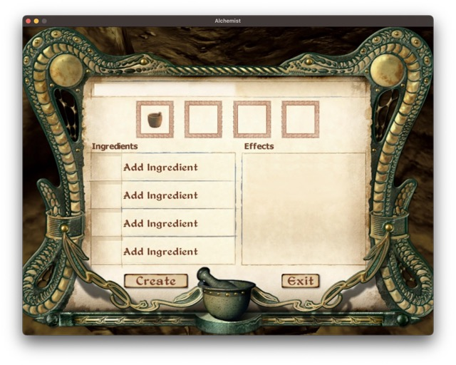
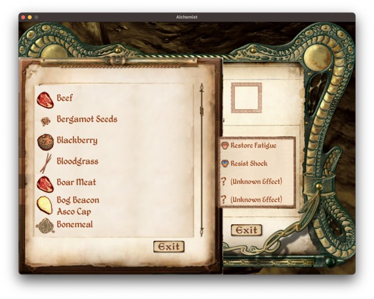
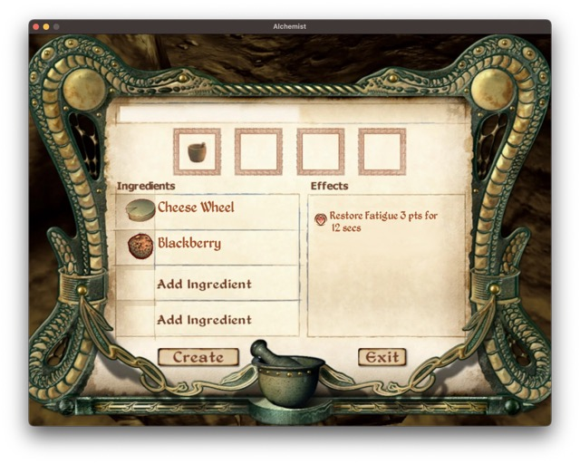

# alchemist

This is an implementation of an alchemy system from The Elder Scrolls IV: Oblivion.
It uses https://github.com/faiface/pixel as OpenGL adapter to create windows and draw elements.

## Requirements
https://github.com/faiface/pixel#requirements

## Domain

Currently, only mortar is implemented.
Retort, Calcinator and Alembic are in backlog.
Some ingredients sprites are missing. They are commented in ingredient_repository.
Ingredient replacement needs to be implemented yet.

## GUI

Alchemist level, luck and mortar level are currently hardcoded in main.go.
Ingredient replacement needs to be implemented yey.

